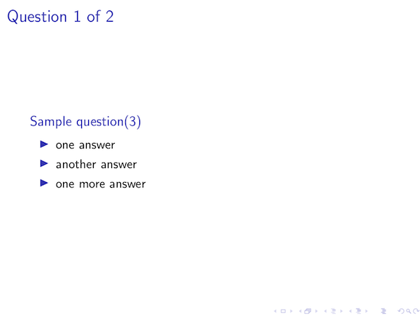

# About StudyPresGenerator
### Overview

StudyPresGenerator is a simple command line ruby application for creating flashcard study presentations. It takes a JSON file of question and answers as input and uses LaTeX to create the presentation.

### Inspiration

I find flashcards to be an effective method of studying. However, there is a physical cost to creating them. In order to remove this cost, I decided to make a digtal version of the flash cards. Using LaTeX to create the presentation is fast and easy, and ruby's access to ERB makes filing in LaTeX templates a breeze. 

### Features

The script's main feature is to create a LaTeX presentation from the input JSON. Other features include:
- Automatic numbering of the questions
- Counting the number of answer items and displaying it in the question
- Giving the option to randomize the question order using a command line flag

This are a list of current features, but new ones could be added in the future.

# Running the app

### Dependencies
- ruby (any modern version should work)
- LaTeX (download and install an appropriate distribution for your OS)

### Setup

The exact command to run the LaTeX compiler differs based on distribution. Follow the comments in ```genStudyPres.rb``` on steps on how to update the command.

### Running the app

The simpliest way to run the app is `ruby genStudyPres.rb -i FILENAME`. For full options list and usage, run with the `-h` flag.

# Questions JSON Spec

### A sample slide and its source JSON file:


```JSON
{
    "questions": [
        {
            "question": "Sample question",
            "answers": [
                "one answer",
                "another answer",
                "one more answer"
            ]
        },
        {
            "question": "Another question",
            "answers": [
                "only one answer"
            ]
        }
    ]
}
```

`questions`: The array of the question objects

`question`: The question string to appear on the slide

`answers`: The array of answer strings for the question. Each item will appear as a seperate bullet point
